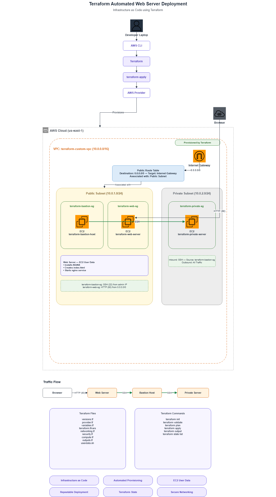
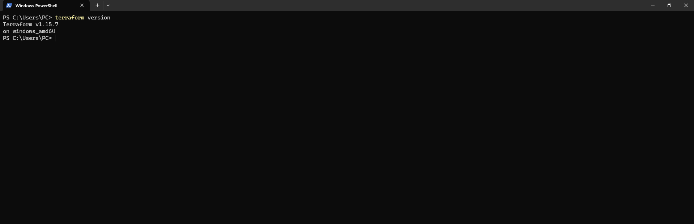
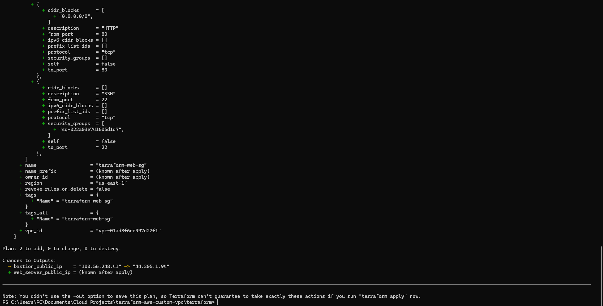
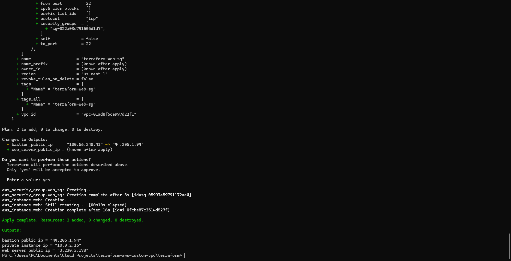
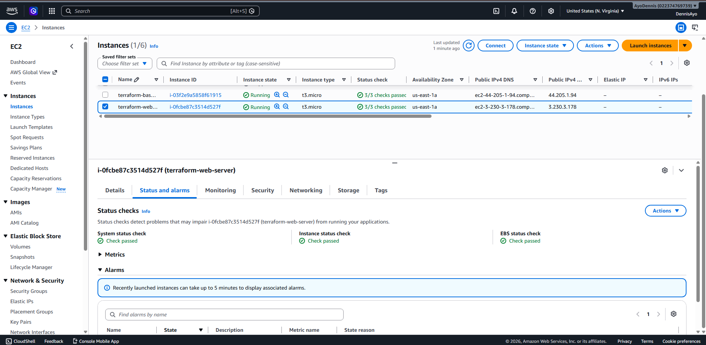
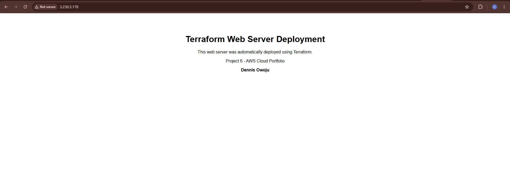

# Terraform AWS Web Server Deployment

A hands-on Infrastructure as Code (IaC) project that automates the deployment of a secure AWS web server environment using **Terraform**.

This project extends a custom AWS networking environment by provisioning a public web server with **NGINX** installed automatically through **EC2 User Data**, alongside a Bastion Host and a private EC2 instance.

---

## Project Overview

This project provisions the following AWS resources using Terraform:

- Custom VPC
- Public Subnet
- Private Subnet
- Internet Gateway
- Public Route Table
- Route Table Association
- Bastion Host
- Private EC2 Instance
- Public NGINX Web Server
- Security Groups
- Terraform Outputs
- EC2 User Data Automation

The web server is configured automatically during launch without requiring manual SSH configuration.

---

## Architecture

<p align="center">

</p>

---

## Technologies Used

- Terraform
- AWS CLI
- Amazon EC2
- Amazon VPC
- AWS IAM
- Ubuntu Linux
- NGINX
- EC2 User Data
- SSH
- Git
- GitHub

---

## Repository Structure

```text
terraform-aws-web-server/
│
├── Architecture/
│   ├── terraform-web-server-architecture.drawio
│   └── terraform-web-server-architecture.png
│
├── Screenshots/
│   ├── Terraform-version.png
│   ├── AWS-access-key-created.png
│   ├── AWS-configure-success.png
│   ├── Terraform-plan-webserver.png
│   ├── Terraform-apply-webserver.png
│   ├── Terraform-webserver-running.png
│   ├── Terraform-webpage.png
│   └── ...
│
├── terraform/
│   ├── versions.tf
│   ├── provider.tf
│   ├── variables.tf
│   ├── terraform.tfvars
│   ├── networking.tf
│   ├── security.tf
│   ├── compute.tf
│   ├── outputs.tf
│   └── userdata.sh
│
├── README.md
├── LICENSE
└── .gitignore
```

---

# Infrastructure Provisioned

Terraform deploys:

- Custom VPC (10.0.0.0/16)
- Public Subnet
- Private Subnet
- Internet Gateway
- Route Table
- Bastion Host
- Private EC2 Instance
- Public NGINX Web Server
- Security Groups
- EC2 User Data
- Terraform Outputs

---

# Deployment Workflow

## 1. Install Terraform



---

## 2. Configure AWS CLI


---

## 3. Initialize Terraform

```bash
terraform init
```

---

## 4. Validate Configuration

```bash
terraform validate
```

---

## 5. Review the Deployment Plan

```bash
terraform plan
```



---

## 6. Deploy the Infrastructure

```bash
terraform apply
```



---

## 7. Verify the Web Server

Terraform provisions the EC2 instance and automatically executes the User Data script to:

- Update Ubuntu packages
- Install NGINX
- Enable the NGINX service
- Start the web server
- Create a custom landing page

Running Instance:



---

## 8. Test the Deployment

Open the public IP of the web server in a browser.

Expected Result:



The webpage is served automatically without any manual configuration after deployment.

---

# Security Architecture

The infrastructure follows AWS security best practices:

- Bastion Host provides secure SSH access.
- Private EC2 instance remains inaccessible from the public internet.
- The NGINX web server exposes only HTTP (Port 80).
- Security Groups enforce controlled inbound access.
- Infrastructure is fully reproducible using Terraform.

---

# Automation with EC2 User Data

The deployment uses **EC2 User Data** to automate server configuration during launch.

The User Data script performs the following actions automatically:

- Updates system packages
- Installs NGINX
- Enables and starts the NGINX service
- Creates a custom HTML landing page

This eliminates the need for manual software installation after instance creation.

---

# Skills Demonstrated

- Infrastructure as Code (IaC)
- Terraform
- AWS CLI
- Amazon EC2
- Amazon VPC
- Security Groups
- Internet Gateway
- Route Tables
- EC2 User Data
- Linux Administration
- NGINX
- SSH
- Git
- GitHub

---

# Learning Outcomes

Through this project I learned how to:

- Extend existing infrastructure using Terraform
- Automate software installation with EC2 User Data
- Deploy an NGINX web server without manual configuration
- Reuse Terraform variables across resources
- Validate infrastructure before deployment
- Verify infrastructure using browser-based testing
- Build repeatable cloud deployments

---

# Key Terraform Commands

```bash
terraform init
terraform validate
terraform plan
terraform apply
terraform output
terraform state list
terraform destroy
```

---

## Author

**Dennis Owoju**

Aspiring Cloud Engineer | Computer Engineering Student | AWS Certified Cloud Practitioner (In Progress)

GitHub:

https://github.com/owojudennis-lab
